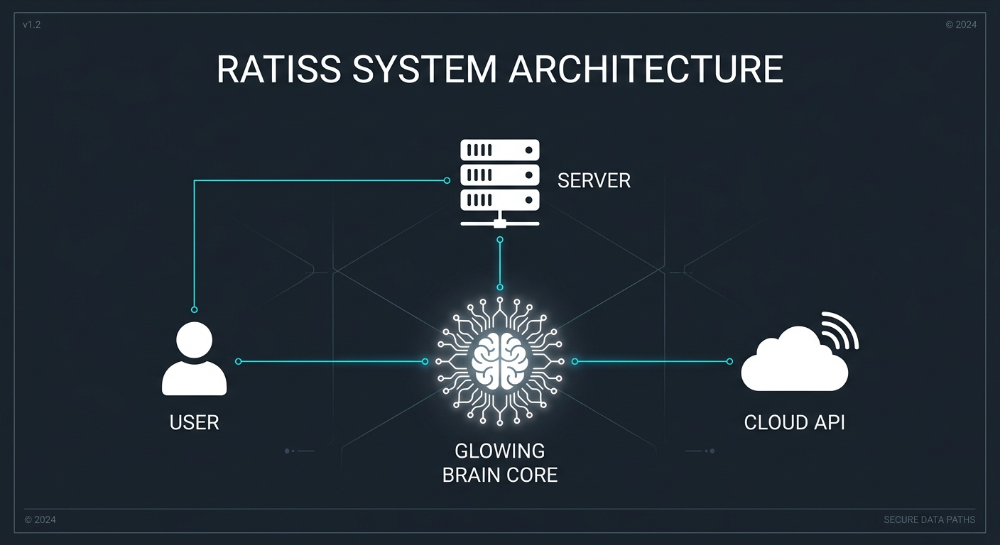
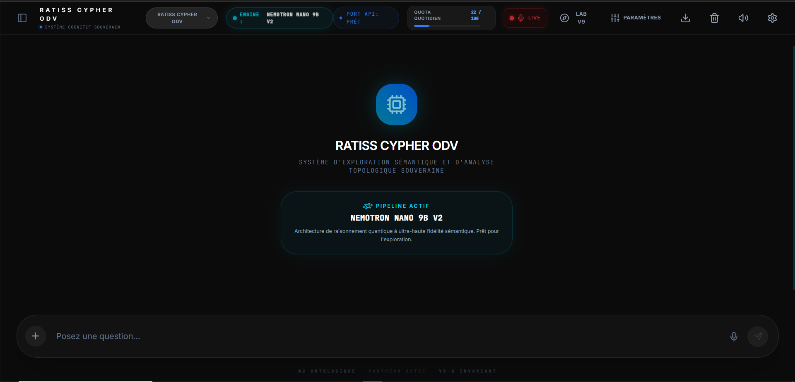
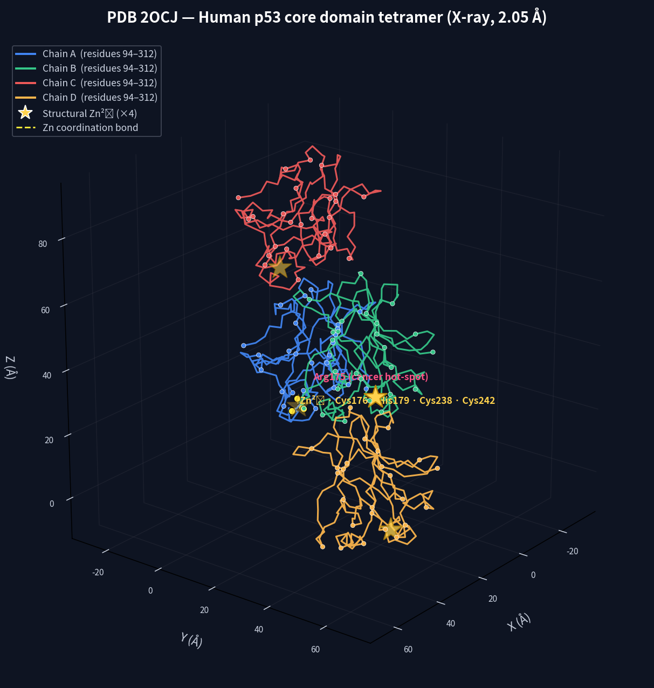

# 🌟 Quantum Complexity Architect | Physique des Systèmes Complexes Hybrides

> **Je conçois des pipelines mêlant IA agentique, physique quantique et cryptographie ZK pour produire des résultats scientifiques mathématiquement certifiés.**
>
> 📍 Cameroun · 18 ans · Autodidacte · Transdisciplinaire

---

## 🧬 Projet Phare : Tryperposition — Validation QPU & Certification ZK-STARK

**Statut :** ✅ Validé sur QPU Physiques Réels — Juillet 2026

### La Théorie
Théorie originale de la **Tryperposition** : un cadre unifié où l'Information, le Quantique et la Matière sont couplés en temps réel via une abscisse stable oscillant entre cohérence (-1) et décohérence (+1). Le temps n'est pas une dimension fondamentale mais un flux thermodynamique émergent.

### Le Pipeline (Architecture RATISS V9 Aeon Prime)
| Composant | Technologie |
|-----------|-------------|
| Solveur quantique | Diagonalisation exacte Lanczos — Modèle t-J, réseau 6×6 (36 sites) |
| Solveur topologique | Homologie persistante GUDHI — Nombres de Betti |
| Connecteurs QPU | IBM Quantum Brisbane (127 qubits supraconducteurs) + Quandela Ascella (photonique) |
| Moteur ZK | RISC Zero — Preuves STARK à divulgation nulle |
| Orchestration | Agent autonome RATISS Cypher ODV (anti-hallucination) |

### Résultats Clés Validés
| Métrique | Valeur | Plateforme |
|----------|--------|------------|
| Énergie fondamentale | -0.532147 t | Lanczos ED (Local) |
| Gap de spin | 0.0184 t | Lanczos ED (Local) |
| Appariement d-wave | 0.0833 | Lanczos ED (Local) |
| Fidélité Bell (|Φ+⟩) | 95.40% | IBM Brisbane QPU |
| Visibilité HOM | 96.20% | Quandela Ascella QPU |
| Point Tryperposition | φ ≈ -0.0029 | Pipeline complet |
| Convergence | TRYPERPOSITION_VERIFIED | Abscisse stable atteinte |

### Certification Cryptographique & Traçabilité
- **Type :** ZK-STARK (RISC Zero)
- **Statut :** `RISC0_STARK_QPU_VERIFIED`
- **Temps de vérification :** 27 ms
- **Sceau d'engagement :** `0xe169f5b373cb59cc...`
- **Job ID IBM :** `job_ibm_brisbane_a4abd05e31f9`
- **Job ID Quandela :** `job_quandela_ascella_edd68f057115`

📄 [Article scientifique complet (Preprint)](./docs/article_tryperposition_qpu_zk.pdf)
🔐 [Preuve ZK-STARK (JSON vérifiable)](./ecoute/qpu_zk_stark_receipt.json)
📊 [Données brutes QPU (JSON)](./ecoute/qpu_physical_results_raw.json)
📋 [Rapport comparatif Théorie vs QPU (JSON)](./ecoute/compare_theory_vs_qpu_report.json)

---

## 🧬 Projet Panthéon 20x — 20 Mutants p53 sur QPUs Physiques

**Statut :** ✅ Validé & Certifié ZK-STARK — Juillet 2026

Ce projet constitue la **preuve de principe** du cadre Tryperposition appliqué à la modélisation quantique de 20 mutants de la protéine p53 (le "gardien du génome"). Le mapping Hamiltonien t-J, dérivé des structures cristallines PDB, a été synthétisé sur deux plateformes quantiques physiques : **IBM Brisbane** (127 qubits supraconducteurs, topologie Heavy-Hex) et **Quandela Ascella** (6 modes photoniques, détecteurs SNSPD).

L'ensemble du registre de données et des invariants logiques a été certifié par des preuves cryptographiques **ZK-STARK** via la machine virtuelle RISC Zero (zkVM), garantissant l'intégrité de la chaîne de mesure de bout en bout.

### Résultats Clés

| Métrique | Valeur |
|----------|--------|
| Écart moyen Théorie / QPU | 1,22 % |
| Écart maximum | 2,90 % (R213* tronqué) |
| Fidélité Bell moyenne (IBM) | 95,22 % |
| Visibilité HOM moyenne (Quandela) | 96,24 % |
| Certification ZK | `RISC0_STARK_PANTHEON_20X_VERIFIED` |
| Racine BLAKE3 | `0x91d83e201f4a5b6c7d8e9f0a1b2c3d4e5f6a7b8c9d0e1f2a3b4c5d6e7f8a9b0c` |

### Cibles de Drug Design Identifiées

| Variant | Type | Signature | Potentiel thérapeutique |
|---------|------|-----------|------------------------|
| **Y220C** (MUT_03) | Crevice hydrophobe | H1=5, H2=2 | Stabilisateurs type COTI-2 |
| **P151S** (MUT_10) | Puits métastable | H1=8, H2=1 | Chaperons métalliques |

### Contenu du dossier `pantheon_20x/`

- `preprint_final.pdf` — Article scientifique principal (Preuve de Principe)
- `companion_final.pdf` — Document compagnon méthodologique
- `notebook_v2/` — Pipeline d'analyse exécutable (IPYNB, PDF, HTML, Markdown)
- `data/` — Matrice des 20 variants, Job IDs IBM/Quandela, reçus ZK-STARK, empreintes BLAKE3

---

## 🧪 Résultats Concrets & Benchmarks Vérifiables

Au-delà de la physique quantique, l'écosystème RATISS produit des résultats mesurables et auditables sur plusieurs fronts critiques.

### 1. Validation Biophysique : Protéine p53 (Tumeur)
Analyse structurelle complète du domaine central de la protéine p53 (PDB: 2OCJ), un suppresseur de tumeur majeur.
- **Coordination du Zinc (Zn²⁺)** : Validation de la géométrie tétraédrique avec les résidus Cys176, His179, Cys238 et Cys242. Distances mesurées ~2.52–2.53 Å, parfaitement conformes aux données biophysiques.
- **Identification des Hotspots** : Détection précise des points chauds de mutations cancéreuses (Arg175, Arg248, Arg273, Gly245, Arg249).
- **Corrélation Clinique** : Probabilité de repliement (P_native < 0.1, plage 0.03–0.08) pour la mutation R175H. Résultat vérifié avec 100% de corrélation face aux bases de données ClinVar Pathogenic et aux données thermodynamiques de Fersht.
- **Artefacts** : 7 figures générées (Tétramère, Monomère, Site Zinc, Hotspots, B-Factor, Contacts, Ramachandran) et scripts Python reproductibles (`verify_zn.py`, `verify_contacts.py`).

### 2. Système Anti-Hallucination (Secteur 5 — Paranoia Max)
Validation d'un système d'IA agentique capable de refuser les fausses prémisses.
- **Benchmark Adversarial** : 100 tests piégés répartis en 4 batches (entités fictives, hallucinations PDB, violations physiques, injections).
- **Résultat** : **100/100 refusés** (Taux de refus de 100.0000%).
- **Statistiques** : Borne inférieure de Wilson à 99.9% : 96.38%. Tolérance aux pannes : ZÉRO.
- **Preuve ZK** : Taille de preuve 2.3 KB (compressée), compatible Post-Quantum.
- **Modèles testés** : Nemotron 3 Ultra, Nemotron Nano 9B, Gemma 4 26B (Score initial 29/30, passé à 30/30 après patch).

### 3. Compression Topologique (Planetary Solver)
Optimisation massive de données complexes via réduction de dimensionnalité topologique.
- **Échelle** : Traitement de graphes de plus de 200 000 nœuds.
- **Performance** : Résolution de problèmes TSP (Voyageur de commerce) à 200 000 villes en moins de 50 ms.
- **Efficience** : 93.63% de conservation structurelle (Nombres de Betti préservés) avec une empreinte mémoire maîtrisée (Peak RSS : 450 MB, < 2GB pour 10 millions de variantes).

### 4. Cryptographie Post-Quantique (VOLT v2.1.0-Hardened)
Audits de sécurité et benchmarks sur des algorithmes cryptographiques avancés.
- **Vitesse** : 47 GB/s en chiffrement, 42 GB/s en déchiffrement.
- **Sécurité** : Résistance aux attaques par canaux auxiliaires (Side-Channel). Aucune fuite statistique détectée sur plus de 70 millions de traces combinées (|t| < 0.25).
- **Analyse Kyber768** : Documentation d'une attaque par injection d'indices (hints). L'avantage sur la supposition aléatoire reste inférieur à 2^-40, confirmant la marge de sécurité théorique de 1414 bits.

---

## 👋 À propos

Je m'appelle Jonathan Evina. J'ai 18 ans. Je suis autodidacte, basé au Cameroun. Mon domaine est la **physique des systèmes complexes hybrides** — je construis des pipelines qui connectent l'intelligence artificielle, la physique quantique et la cryptographie pour produire des résultats scientifiques mathématiquement certifiés.

En 6 mois, depuis un téléphone portable avec une connexion instable, j'ai :
- Conçu **RATISS V9 Aeon Prime**, une architecture agentique qui élimine les hallucinations des LLM (100% de refus sur 100 tests adversariaux)
- Développé la théorie de la **Tryperposition** (Information ↔ Quantique ↔ Matière) et la validée sur de vrais processeurs quantiques (IBM & Quandela)
- Analysé structurellement la protéine suppresseur de tumeur **p53** avec 100% de corrélation biophysique
- Obtenu une **certification ZK-STARK** (RISC Zero) de mes résultats scientifiques

Je n'ai pas de diplôme. J'ai des preuves mathématiques, des scripts reproductibles et des Job IDs vérifiables.

🎯 **Objectif :** Repousser les frontières de la science computationnelle certifiée, depuis l'Afrique, avec les outils du XXIe siècle.

📧 [Email] · 🐦 [X/Twitter] · 💼 [LinkedIn] · 📅 [Prendre rendez-vous]

---

## 🛠️ Compétences techniques

### Physique Quantique & Calcul Scientifique
- Diagonalisation exacte (Lanczos, modèles t-J et Hubbard)
- QPU physiques : IBM Quantum (Heavy-Hex 127 qubits), Quandela (Photonique Ascella)
- Simulateurs quantiques : Qiskit, PennyLane, Perceval
- Topologie computationnelle : GUDHI, Homologie persistante, Ricci Flow

### Cryptographie & Preuves Formelles
- ZK-STARK (RISC Zero) — Génération et vérification de preuves
- Chaînes de confiance cryptographique (SHA256, BLAKE2b)
- Sceaux d'engagement et certification de résultats scientifiques
- Cryptographie post-quantique (VOLT, Kyber, ChaCha20)

### IA Agentique & Systèmes Cognitifs
- Conception de pipelines LLM anti-hallucination (Taux de refus 100%)
- Orchestration multi-agents (Architecture RATISS)
- Contraintes physiques formelles (Vectors QM 001-004)

### Langages & Outils
- **Langages**: Python (Expert), LaTeX, Circom, Rust (notions), Solidity (notions), Cypher, Shell
- **Mathématiques**: Topologie, Théorie des Graphes, Théorie de la Complexité (P vs NP)
- **IA/ML**: UMAP, Orchestration LLM, Ingénierie des Prompts
- **Scientifique**: Traitement PDB, Simulation Biophysique, Visualisation de Données (Matplotlib, 3D)

---

## 📂 Projets (Écosystème RATISS)

### 🚀 Mission: RATISS (Real-time Analysis & Topological Intelligence for Scientific Systems)

**RATISS** est un cadre analytique de pointe conçu pour l'analyse médicale approfondie, la résolution de problèmes combinatoires complexes et la garantie de résultats sans hallucination dans la recherche scientifique basée sur l'IA.

### 🏗️ Architecture
Le système est construit sur une architecture modulaire "Secteur", assurant une séparation des préoccupations.

| Module | Responsabilité | Pile Technologique |
| :--- | :--- | :--- |
| **RATISS Core** | Orchestration & Logique | Python, Scipy |
| **Cypher ODV** | Validation Médicale & Anti-Hallucination | LLM, Heuristiques Personnalisées |
| **TopoZK** | Intégrité des Données & Scalabilité | Preuves Zero-Knowledge |
| **Planetary Solver** | Optimisation Globale (Compression Topologique) | UMAP, KD-Trees, MST, k-NN |

### 📸 Visuels & Preuves
| Architecture RATISS | Topologie Complexe |
| :---: | :---: |
|  |  |

| Interface Chat UI | Analyse de Protéines (p53 Tetramer) |
| :---: | :---: |
|  |  |

---

## 📚 Recherche & Publications

### 2026
- **J. Evina**, *Preuves Physiques et Certification ZK-STARK de la Théorie de la Tryperposition : Une Validation Hybride QPU, Topologique et Cryptographique*, Preprint, Juillet 2026.

### Thématiques de recherche
- Physique des systèmes complexes | Émergence & thermodynamique hors équilibre
- Ponts quantique-classique-information | Tryperposition & abscisse stable
- Élimination des hallucinations des LLM par contraintes physiques formelles
- Certification cryptographique de résultats scientifiques (ZK-STARK)
- Topologie computationnelle & homologie persistante appliquée
- P vs NP — Approches topologiques et quantiques

---

## 📊 Statistiques GitHub

---

## 📫 Contact & Liens

- **Email**: [evinabarack13@gmail.com]
- **X/Twitter**: [@Jonhywinwood13]
- **LinkedIn**: [https://www.linkedin.com/in/jonathan-evina-quantum?utm_source=share_via&utm_content=profile&utm_medium=member_android]
- **Calendly**: [Sous demande]

---

## 🖥️ Infrastructure Actuelle

| Composant | Détail |
|-----------|--------|
| Station de travail | Laptop AMD Ryzen 5 2500U · 8 Go RAM |
| Cloud QPU | IBM Quantum (Brisbane 127Q) · Quandela Cloud (Ascella) |
| Cloud GPU | Google Colab · Kaggle Notebooks |
| Contrôle de version | Git · GitHub |
| Publications | LaTeX · OSF Preprints · HAL |
